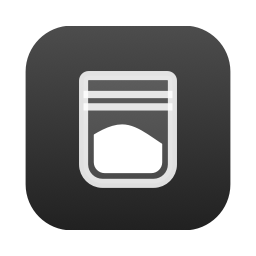
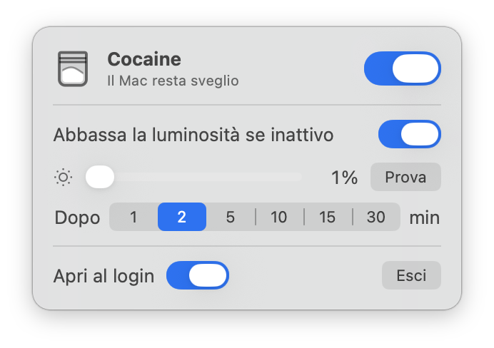

<p align="center"></p>

<h1 align="center">Cocaine</h1>

<p align="center"><b>Tiene sveglio il Mac, anche col coperchio chiuso.</b><br>
Una piccola app gratuita e open source per la barra dei menu di macOS.</p>

<p align="center"></p>

🇬🇧 [Read in English](README.md)

- **Bustina piena = attivo.** Il Mac non va in stop, nemmeno col coperchio chiuso. Funziona anche su Apple Silicon,
  senza componenti aggiuntivi da installare.
- **Bustina vuota = spento.** Il Mac si comporta normalmente.
- **Parla la tua lingua:** italiano, inglese, cinese (semplificato e tradizionale), spagnolo, francese, tedesco e giapponese.
  Segue la lingua del Mac (altrimenti l'inglese), oppure la scegli dalla bandiera nel pannello.
- **Luminosità.** Mentre è attivo, può abbassare lo schermo integrato al livello che scegli dopo qualche minuto di
  inattività. Lo schermo non si spegne mai del tutto, e torna com'era appena tocchi tastiera o trackpad.
- **Anche con monitor esterni.** I monitor Apple abbassano la retroilluminazione, gli altri si scuriscono via software, e col
  coperchio chiuso si abbassano solo gli schermi esterni. Il pannello si apre sotto l'icona che clicchi, su qualunque schermo.

<p align="center"></p>

Richiede macOS 14 (Sonoma) o successivo. Funziona su Mac Apple Silicon e Intel, pesa circa 600 KB, è gratis.

## Installazione

**Con Homebrew (il modo più semplice):**

```
brew install --cask mattiakart/tap/cocaine
```

Homebrew ti chiede la password del Mac **una volta**, direttamente nel Terminale, per dare il permesso a Cocaine. Se hai attivato
Touch ID per sudo, basta l'impronta. Nient'altro: nessuna finestra, niente "Apri comunque".
`brew upgrade` non chiede mai nulla, e `brew uninstall --cask cocaine` toglie tutto senza chiedere.

**Oppure scarica il .dmg** dalla pagina [Releases](../../releases/latest):

1. Apri il `.dmg` e trascina **Cocaine** in **Applicazioni**.
2. Aprila. macOS la blocca, perché l'app non è firmata da uno sviluppatore registrato presso Apple:
   vai in **Impostazioni di Sistema → Privacy e sicurezza** e clicca **"Apri comunque"**. Serve solo la prima volta.
3. Cocaine chiede **una volta** la password. macOS la mostra con un avviso perché l'app non è verificata da Apple: è normale.

In entrambi i casi quell'autorizzazione installa una regola sudo che permette solo `pmset -a disablesleep 1`,
`pmset -a disablesleep 0` e la cancellazione della regola stessa. Nient'altro.

## Avvisi quando un'AI finisce

Lasci il Mac a lavorare, e Cocaine ti richiama quando un'AI finisce o ha bisogno di te. Se non sei al Mac riaccende gli
schermi, riporta la luminosità, li fa lampeggiare e mostra chi ti cerca e in quale progetto. Se sei al Mac, la bustina
nella barra si ricarica e basta.

Apri **Avvisi AI** nel pannello. I suoi quattro gruppi mostrano un riassunto in una riga e si aprono uno alla volta:
**AI collegate** (un interruttore per ciascuna, con cosa segnala), **Quando** (finisce, ha bisogno di te, anche quando
sei al Mac), **Come** (lampeggio, suono, voce, quanto resta l'avviso sullo schermo, promemoria ogni 2, 5 o 10 minuti
mentre sei via, e una prova) e **Pausa** (30 minuti, un'ora o fino a domani). Sotto, separati dalle impostazioni,
gli **Ultimi avvisi**: gli ultimi tre, con il progetto da cui arrivano.

| AI | Finisce | Ha bisogno di te | Dove va l'hook di Cocaine |
|---|---|---|---|
| Claude Code | ✓ | ✓ permesso o domanda | `~/.claude/settings.json` |
| Codex (CLI e app ChatGPT) | ✓ | ✓ approvazione | `~/.codex/hooks.json` |
| Cursor | ✓ | – | `~/.cursor/hooks.json` |
| GitHub Copilot (CLI e VS Code) | ✓ | ✓ nella CLI | `~/.copilot/hooks/cocaine.json` |
| Gemini CLI | ✓ | ✓ permesso | `~/.gemini/settings.json` |
| Windsurf | ✓ dopo ogni risposta | – | `~/.codeium/windsurf/hooks.json` |
| Qwen Code | ✓ | ✓ permesso | `~/.qwen/settings.json` |
| OpenCode | ✓ | ✓ permesso o domanda | `~/.config/opencode/plugins/cocaine.js` |

Cocaine aggiunge solo i suoi hook e lascia com'è tutto il resto di quei file. Togliendo la spunta a un'AI li rimuove, e
lo fa anche `brew uninstall`. Codex esegue un hook nuovo solo dopo che l'hai approvato una volta (te lo chiede all'avvio
nel Terminale, oppure nell'app ChatGPT vai in Impostazioni → Hooks): finché non lo fai, il pannello te lo ricorda.
Cursor esegue anche gli hook di Claude Code, quindi quello di Cocaine per Claude Code dentro Cursor tace: niente avvisi
doppi.

**Qualsiasi altro programma** può suonare il "campanello":

```
open -g "cocaine://alert?from=Il%20mio%20script&event=done"     # event=done o input; project=nome; oppure message=testo
```

- **Altre AI** con hook o plugin che possono eseguire quel comando: Aider (`notifications-command` in
  `~/.aider.conf.yml`), Cline (`~/Documents/Cline/Hooks/TaskComplete`), Factory Droid (`~/.factory/hooks.json`), Kiro,
  Amp, Goose, JetBrains Junie (non sull'hook `PermissionRequest`: se esce senza decidere, Junie approva l'azione).
- **Build e terminali:** Xcode (Impostazioni → Behaviors → Run script), qualsiasi comando lungo (`make; open -g …`),
  `notify_on_cmd_finish` di kitty, i Trigger di iTerm2, `alert-silence` di tmux.
- **CI e git:** `gh run watch --exit-status; open -g …`, hook di git come `post-merge`.
- **App di automazione:** Comandi Rapidi ("Apri URL"), Keyboard Maestro, Hammerspoon, BetterTouchTool, `WatchPaths` di
  launchd, regole di Mail.

Gli hook di Cocaine iniziano con `pgrep -qx Cocaine`: l'avviso parte solo se Cocaine è aperto, e non lo riapre se l'hai
chiuso.

## Feedback e assistenza

La ✉︎ accanto alla versione, nel pannello, apre una mail all'autore con le versioni di Cocaine e di macOS già scritte.
Bug e idee sono benvenuti anche come [issue su GitHub](https://github.com/Mattiakart/cocaine/issues).

## Da sapere

- Mentre Cocaine è attivo il Mac **non si blocca da solo**, anche col coperchio chiuso: bloccalo con ⌃⌘Q.
- A batteria e col coperchio chiuso il Mac continua a consumare, e non va in stop nemmeno con la batteria quasi scarica.
- Quando apri l'app, Cocaine si attiva, e quando la chiudi si disattiva. Vale per **Esci**, ⌘Q, la disconnessione e lo spegnimento.

## Disinstallazione

Con Homebrew: `brew uninstall --cask cocaine`. Spegne Cocaine e toglie l'app, la regola sudo e gli hook degli Avvisi AI,
senza chiedere nulla. (`--zap` cancella anche le impostazioni.)

Senza Homebrew: togli le spunte in Avvisi AI, esci da Cocaine (così si spegne), spostala nel Cestino, poi nel Terminale:

```
sudo rm /etc/sudoers.d/cocaine
```

## Come funziona

- `pmset -a disablesleep 1` impedisce lo stop, anche a coperchio chiuso. L'app installa una regola sudo che
  permette senza password **solo** i due comandi `pmset -a disablesleep 1` e `pmset -a disablesleep 0`.
- Mentre è attivo, `caffeinate -d` tiene acceso lo schermo.
- La luminosità è gestita con le API DisplayServices di macOS.

Codice: `main.swift` (app per la barra dei menu, Swift/SwiftUI) e `cocaine.zsh` (lo script "motore").
Per compilare: `./build.sh --dmg`.

## Licenza

MIT: vedi [LICENSE](LICENSE).
