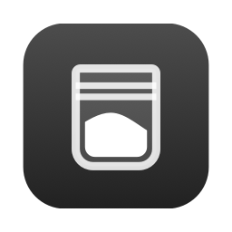
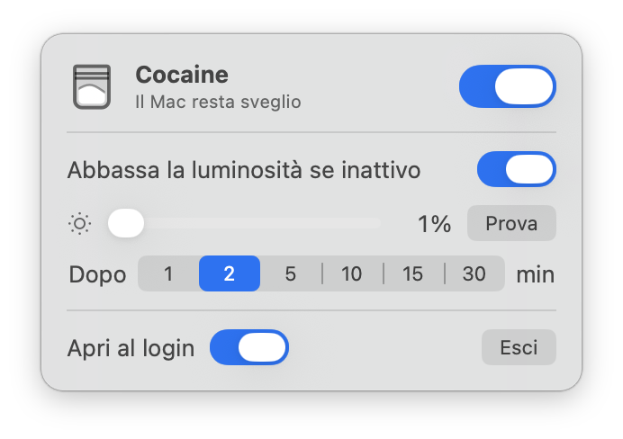

<p align="center"></p>

<h1 align="center">Cocaine</h1>

<p align="center"><b>Tiene sveglio il Mac, anche col coperchio chiuso.</b><br>
Una piccola app gratuita e open source per la barra dei menu di macOS.</p>

<p align="center"></p>

🇬🇧 [Read in English](README.md)

- **Bustina piena = attivo.** Il Mac non va in stop, nemmeno col coperchio chiuso. Funziona anche su Apple Silicon,
  senza componenti aggiuntivi da installare.
- **Bustina vuota = spento.** Il Mac si comporta normalmente.
- **Un interruttore.** Quello in alto nel pannello attiva o spegne Cocaine; mentre si accende ci scende dentro una
  sottile striscia di polvere.
- **Parla la tua lingua:** italiano, inglese, cinese (semplificato e tradizionale), spagnolo, francese, tedesco e giapponese.
  Segue la lingua del Mac (altrimenti l'inglese), oppure la scegli dalla bandiera nel pannello.
- **Luminosità.** Mentre è attivo, può abbassare lo schermo integrato al livello che scegli dopo qualche minuto di
  inattività. Lo schermo non si spegne mai del tutto, e torna com'era appena tocchi tastiera o trackpad.
- **Anche con monitor esterni.** I monitor Apple abbassano la retroilluminazione, gli altri si scuriscono via software, e col
  coperchio chiuso si abbassano solo gli schermi esterni. Il pannello si apre sotto l'icona che clicchi, su qualunque schermo.

<p align="center"></p>

Richiede macOS 14 (Sonoma) o successivo. Funziona su Mac Apple Silicon e Intel, pesa circa 600 KB, è gratis.

## Installazione

**Con Homebrew (il modo più semplice):**

```
brew install --cask mattiakart/tap/cocaine
```

Homebrew ti chiede la password del Mac **una volta**, direttamente nel Terminale, per dare il permesso a Cocaine. Se hai attivato
Touch ID per sudo, basta l'impronta. Nient'altro: nessuna finestra, niente "Apri comunque".
`brew upgrade` non chiede mai nulla, e `brew uninstall --cask cocaine` toglie tutto senza chiedere.

**Oppure scarica il .dmg** dalla pagina [Releases](../../releases/latest):

1. Apri il `.dmg` e trascina **Cocaine** in **Applicazioni**.
2. Aprila. macOS la blocca, perché l'app non è firmata da uno sviluppatore registrato presso Apple:
   vai in **Impostazioni di Sistema → Privacy e sicurezza** e clicca **"Apri comunque"**. Serve solo la prima volta.
3. Cocaine chiede **una volta** la password. macOS la mostra con un avviso perché l'app non è verificata da Apple: è normale.

In entrambi i casi quell'autorizzazione installa una regola sudo che permette solo `pmset -a disablesleep 1`,
`pmset -a disablesleep 0` e la cancellazione della regola stessa. Nient'altro.

## Avvisi quando un'AI finisce

Lasci il Mac a lavorare, e Cocaine ti richiama quando un'AI finisce o ha bisogno di te. Se non sei al Mac riaccende gli
schermi, riporta la luminosità, li fa lampeggiare e mostra chi ti cerca e in quale progetto. Se sei al Mac, la bustina
nella barra si ricarica e basta.

Apri **Avvisi AI** nel pannello. I suoi quattro gruppi mostrano un riassunto in una riga e si aprono uno alla volta:
**AI collegate** (un interruttore per ciascuna, con cosa segnala), **Quando** (finisce, ha bisogno di te, anche quando
sei al Mac, oppure una volta sola per sessione, quando non resta niente in corso, invece che per ogni agent o task che finisce), **Come** (lampeggio, suono, voce e quale, quanto resta l'avviso sullo schermo, promemoria ogni 2, 5 o 10 minuti
mentre sei via, e una prova) e **Pausa** (30 minuti, un'ora o fino a domani). Sotto, separati dalle impostazioni,
gli **Ultimi avvisi**: gli ultimi tre, con il progetto da cui arrivano.

| AI | Finisce | Ha bisogno di te | Dove va l'hook di Cocaine |
|---|---|---|---|
| Claude Code | ✓ | ✓ permesso o domanda | `~/.claude/settings.json` |
| Codex (CLI e app ChatGPT) | ✓ | ✓ approvazione | `~/.codex/hooks.json` |
| Cursor | ✓ | – | `~/.cursor/hooks.json` |
| GitHub Copilot (CLI e VS Code) | ✓ | ✓ nella CLI | `~/.copilot/hooks/cocaine.json` |
| Gemini CLI | ✓ | ✓ permesso | `~/.gemini/settings.json` |
| Windsurf | ✓ dopo ogni risposta | – | `~/.codeium/windsurf/hooks.json` |
| Qwen Code | ✓ | ✓ permesso | `~/.qwen/settings.json` |
| OpenCode | ✓ | ✓ permesso o domanda | `~/.config/opencode/plugins/cocaine.js` |

Cocaine aggiunge solo i suoi hook e lascia com'è tutto il resto di quei file. Togliendo la spunta a un'AI li rimuove, e
lo fa anche `brew uninstall`. Codex esegue un hook nuovo solo dopo che l'hai approvato una volta (te lo chiede all'avvio
nel Terminale, oppure nell'app ChatGPT vai in Impostazioni → Hooks): finché non lo fai, il pannello te lo ricorda.
Cursor esegue anche gli hook di Claude Code, quindi quello di Cocaine per Claude Code dentro Cursor tace: niente avvisi
doppi.

**Qualsiasi altro programma** può suonare il "campanello":

```
open -g "cocaine://alert?from=Il%20mio%20script&event=done"     # event=done o input; project=nome; oppure message=testo
```

- **Altre AI** con hook o plugin che possono eseguire quel comando: Aider (`notifications-command` in
  `~/.aider.conf.yml`), Cline (`~/Documents/Cline/Hooks/TaskComplete`), Factory Droid (`~/.factory/hooks.json`), Kiro,
  Amp, Goose, JetBrains Junie (non sull'hook `PermissionRequest`: se esce senza decidere, Junie approva l'azione).
- **Build e terminali:** Xcode (Impostazioni → Behaviors → Run script), qualsiasi comando lungo (`make; open -g …`),
  `notify_on_cmd_finish` di kitty, i Trigger di iTerm2, `alert-silence` di tmux.
- **CI e git:** `gh run watch --exit-status; open -g …`, hook di git come `post-merge`.
- **App di automazione:** Comandi Rapidi ("Apri URL"), Keyboard Maestro, Hammerspoon, BetterTouchTool, `WatchPaths` di
  launchd, regole di Mail.

Gli hook di Cocaine iniziano con `pgrep -qx Cocaine`: l'avviso parte solo se Cocaine è aperto, e non lo riapre se l'hai
chiuso.

## Feedback e assistenza

La ✉︎ accanto alla versione, nel pannello, apre una mail all'autore con le versioni di Cocaine e di macOS già scritte.
Bug e idee sono benvenuti anche come [issue su GitHub](https://github.com/Mattiakart/cocaine/issues).

## Lavoro da remoto

Lasci il Mac e continui a lavorare dal telefono. Cocaine tiene sveglio il Mac (il coperchio può restare chiuso) e un
piccolo comando ti permette di avviare, seguire e guidare gli agent AI da qualsiasi posto in cui puoi eseguire un comando.

**Da fare una volta, da qualsiasi parte del mondo, senza password e senza altre app.** Cocaine non apre nessuna porta di
rete e non richiede né il Login remoto né una VPN. L'app tiene una connessione in uscita verso un relay ([ntfy](https://ntfy.sh),
lo stesso servizio che possono usare gli avvisi sul telefono) e il Comando Rapido dell'iPhone parla con l'app attraverso di esso.

1. Nel pannello: *Lavoro da remoto → iPhone → Invia*. Scegli cosa può fare il telefono e Cocaine crea un Comando
   Rapido (un menu: Stato, Attiva, Spegni, Progetti, Comando, Ultima risposta), lo firma (servono internet e iCloud sul Mac)
   e apre la condivisione: lo mandi con AirDrop o con Messaggi.
2. Sull'iPhone lo aggiungi e lo esegui. Basta: il segreto che contiene il Mac lo conosce già.

*Comando* accetta qualsiasi comando `cocaine remote`, per esempio `start claude mio-progetto Correggi i test che falliscono`,
`log claude-mio-progetto 30`, `send claude-mio-progetto Sì, procedi` (gli ultimi tre richiedono il livello agent). Il Comando
Rapido aspetta qualche secondo e mostra la risposta; *Ultima risposta* la mostra di nuovo.

Come è protetto: ogni iPhone abbinato riceve due nomi di canale casuali da 192 bit sul relay, uno per i comandi e uno per le
risposte; li conosce solo chi ha il Comando Rapido. Ogni comando passa da una lista fissa di comandi permessi: il livello di
base permette stato, attiva/spegni ed elenco dei progetti; *Anche avviare e guidare gli agenti AI* aggiunge l'avvio degli
agent e la possibilità di scrivere loro, il che equivale a eseguire codice come te: concedilo consapevolmente. I comandi più
vecchi di due minuti non vengono mai eseguiti (un Mac che dormiva non li ripete), al massimo 20 al minuto, e ognuno è
registrato in `~/Library/Application Support/Cocaine/remote-phone.log`. *Revoca* dimentica tutti gli iPhone abbinati: i loro
Comandi Rapidi smettono di funzionare. Trattalo come una chiave: mandalo solo ai tuoi dispositivi.

Cosa vede il relay: il traffico è HTTPS, ma comandi e risposte sono testo in chiaro su quel server (un nome di progetto, il
livello della batteria), protetti solo dai nomi di canale impossibili da indovinare, e li conserva per circa 12 ore. Cocaine
chiede di non inoltrarli al servizio push di Google. Il Comando Rapido stesso si sincronizza tramite iCloud sugli altri tuoi
dispositivi Apple (cifrato end-to-end solo con la Protezione avanzata dei dati), e chi scoprisse i canali potrebbe anche
inviare risposte false. Se non va bene, usa un tuo server ntfy e
indicalo a Cocaine: `defaults write local.cocaine.toggle relayURL https://ntfy.esempio.it` (solo https), poi abbina di nuovo.
Il Mac deve essere sveglio per rispondere: a questo serve Cocaine acceso.

Gli stessi comandi funzionano in Terminale:

```
C=/Applications/Cocaine.app/Contents/Resources/cocaine
$C remote status                       # Cocaine, batteria, agent al lavoro
$C remote on --for 3h                  # Mac sveglio per 3 ore
$C remote projects                     # le cartelle in cui puoi lavorare
$C remote start claude mio-progetto Correggi i test che falliscono
$C remote start codex mio-progetto --resume
$C remote log claude-mio-progetto 30    # cosa mostra l'agent sullo schermo
$C remote send claude-mio-progetto Sì, procedi
$C remote key claude-mio-progetto enter # anche esc, up, down, tab, ctrl-c, y, n, 1-9
$C remote stop claude-mio-progetto
```

Agent: Claude Code, Codex, Gemini CLI, Cursor, GitHub Copilot, OpenCode, Qwen Code e Aider (`remote agents` elenca quelli
installati; `--resume` riprende l'ultima conversazione per Claude Code, Codex, Cursor, Copilot e OpenCode). Ognuno gira
in una sessione `screen` che sopravvive alla chiusura della connessione (`remote attach <run>` la riprende in un
terminale). I progetti sono le cartelle con un `.git` sotto `~/Developer`, `~/Projects`, `~/Documents` e `~/Desktop`
(la lista si cambia in `~/Library/Application Support/Cocaine/projects.conf`). Cocaine si attiva quando parte il lavoro
e torna com'era quando finisce l'ultimo.

**Sapere cosa succede.** Gli hook degli Avvisi AI dicono a Cocaine anche quando un agent inizia a lavorare, aspetta te,
finisce o va in errore, e il pannello li elenca. `remote status` mostra lo stesso, e gli **Avvisi sul telefono** ti
mandano ogni avviso: con `cocaine remote notify shortcut "Nome"` Cocaine esegue quel Comando Rapido (con il testo
dell'avviso come input: costruiscine uno che ti manda un messaggio o una notifica), oppure con
`cocaine remote notify ntfy https://ntfy.sh/il-tuo-argomento-segreto` ricevi una notifica push (il testo dell'avviso
passa da quel servizio). `cocaine remote notify test` lo prova.

**Svegliare il Mac.** È Cocaine attivo a tenerlo raggiungibile. Un Mac già andato in stop non sente il relay, e niente da
internet può svegliare un MacBook in stop con il coperchio chiuso. Quindi, in *Lavoro da remoto*, attiva **Sveglia per
iPhone**: Cocaine programma un breve risveglio ogni 15 minuti (anche con il coperchio chiuso). A ogni risveglio si
ricollega, esegue i comandi che l'iPhone ha mandato nel frattempo (fino a 20 minuti di età), risponde e lascia che il Mac
torni a dormire. Quindi un comando mandato a un Mac in stop riceve risposta entro circa 15 minuti: lo mandi e dopo usi
*Ultima risposta*. Chiede il permesso una volta (estende la regola sudo di Cocaine con `pmset schedule wake`/`cancel wake`,
marcati `cocaine`, nient'altro), consuma un po' di batteria, si ferma a batteria al 20% o meno e viene annullata quando
chiudi Cocaine. Se serve la risposta subito, tieni Cocaine attivo. (`cocaine remote wake-info` stampa ancora quello che serve
a un'app Wake-on-LAN, da usare sulla rete di casa.)

**Anche dai Comandi Rapidi sul Mac**, con i link: `cocaine://on`, `cocaine://off`, `cocaine://toggle`,
`cocaine://timer?minutes=90`, `cocaine://pause?minutes=60`, `cocaine://resume`, `cocaine://panel`.

### Automazioni

Nel pannello, il **Timer** è subito sotto l'interruttore (resta attivo da 30 minuti a 8 ore, poi si spegne). Il resto è nella pagina *Automazioni*: **Battery Guard** (a batteria,
al 10–30 % spegne Cocaine o ti avvisa soltanto), **Smart Triggers** (attivo mentre un'AI lavora o aspetta te, o mentre
girano i programmi scelti; si spegne dopo 3 minuti; se lo spegni tu a mano, vale la tua scelta) e **Scorciatoie**
(⌃⌥⌘C attiva/spegne, ⌃⌥⌘O pannello, ⌃⌥⌘P pausa avvisi).

## Da sapere

- Mentre Cocaine è attivo il Mac **non si blocca da solo**, anche col coperchio chiuso: bloccalo con ⌃⌘Q.
- A batteria e col coperchio chiuso il Mac continua a consumare, e non va in stop nemmeno con la batteria quasi scarica.
- Quando apri l'app, Cocaine si attiva, e quando la chiudi si disattiva. Vale per **Esci**, ⌘Q, la disconnessione e lo spegnimento.

## Disinstallazione

Con Homebrew: `brew uninstall --cask cocaine`. Spegne Cocaine e toglie l'app, la regola sudo e gli hook degli Avvisi AI,
senza chiedere nulla. (`--zap` cancella anche le impostazioni.)

Senza Homebrew: togli le spunte in Avvisi AI, esci da Cocaine (così si spegne), spostala nel Cestino, poi nel Terminale:

```
sudo rm /etc/sudoers.d/cocaine
```

## Come funziona

- `pmset -a disablesleep 1` impedisce lo stop, anche a coperchio chiuso. L'app installa una regola sudo che
  permette senza password **solo** i due comandi `pmset -a disablesleep 1` e `pmset -a disablesleep 0`.
- Mentre è attivo, `caffeinate -d` tiene acceso lo schermo.
- La luminosità è gestita con le API DisplayServices di macOS.

Codice: `main.swift` (app per la barra dei menu, Swift/SwiftUI) e `cocaine.zsh` (lo script "motore").
Per compilare: `./build.sh --dmg`.

## Licenza

MIT: vedi [LICENSE](LICENSE).
