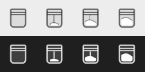

<p align="center"></p>

# Cocaine

Tiene sveglio il Mac, anche col coperchio chiuso. Si accende e si spegne dalla bustina nella barra dei menu.

- **Bustina piena** = attivo: il Mac non va in stop, nemmeno col coperchio chiuso.
- **Bustina vuota** = spento: il Mac si comporta normalmente.
- Mentre è attivo puoi far abbassare la luminosità dopo qualche minuto di inattività. Non scende mai a zero, e torna com'era al primo tocco.

<p align="center"></p>
<p align="center"></p>

Richiede macOS 14 (Sonoma) o successivo. Funziona su Mac Apple Silicon e Intel. È gratis.

## Download

Scarica **Cocaine-1.0.dmg** dalla pagina [Releases](../../releases/latest).

## Installazione

1. Apri il `.dmg` e trascina **Cocaine** in **Applicazioni**.
2. Aprila. macOS la blocca, perché l'app non è firmata da uno sviluppatore registrato presso Apple:
   vai in **Impostazioni di Sistema → Privacy e sicurezza** e clicca **"Apri comunque"**. Serve solo la prima volta.
3. Al primo avvio Cocaine chiede la **password di amministratore**, una volta sola. Le serve il permesso di
   cambiare un'unica impostazione di sistema: `pmset disablesleep`, quella che impedisce lo stop.

## Da sapere

- Mentre Cocaine è attivo il Mac **non si blocca da solo**, anche col coperchio chiuso: bloccalo con ⌃⌘Q.
- A batteria e col coperchio chiuso il Mac continua a consumare, e non va in stop nemmeno con la batteria quasi scarica.
- Quando apri l'app, Cocaine si attiva. "Esci" chiude solo l'icona.

## Disinstallazione

Spegni Cocaine, esci dall'app, spostala nel Cestino, poi nel Terminale:

```
sudo rm /etc/sudoers.d/cocaine
```

## Come funziona

- `pmset -a disablesleep 1` impedisce lo stop, anche a coperchio chiuso. L'app installa una regola sudo che
  permette senza password **solo** i due comandi `pmset -a disablesleep 1` e `pmset -a disablesleep 0`.
- Mentre è attivo, `caffeinate -d` tiene acceso lo schermo.
- La luminosità è gestita con le API DisplayServices di macOS.

Codice: `main.swift` (app per la barra dei menu, Swift/SwiftUI) e `cocaine.zsh` (lo script "motore").
Per compilare: `./build.sh --dmg`.

## Licenza

MIT: vedi [LICENSE](LICENSE).
